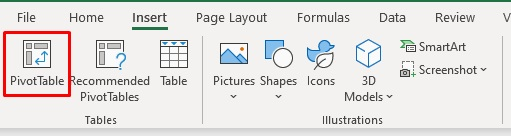
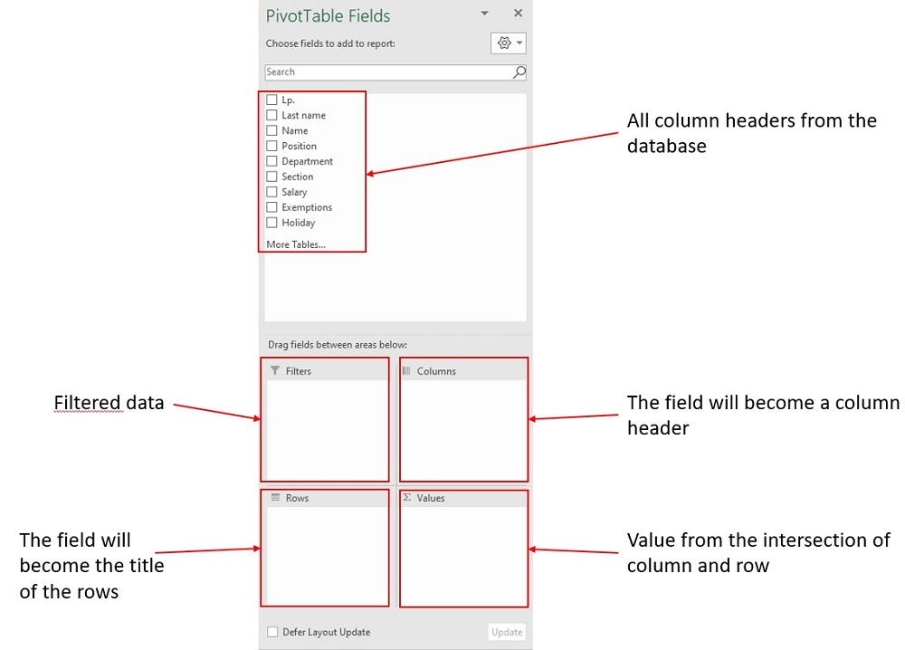

# Excel Pivot Table

## What is a Pivot Table?
A **Pivot table** in Excel is a tool that lets you quickly organize and summarize large amounts of data. It helps you take a big table of data and "pivot" (or rotate) it to look at it from different angles.

For example, if you have sales data with columns like "Date," "Product," "Region," and "Sales Amount," a pivot table can help you quickly see the total sales per product, per region, or even per month, without needing to sort or filter the data manually. You can drag and drop these columns into different areas in the pivot table to get different views of your data.

## How to create a Pivot table?

1. Select the cells from which you want to create a pivot table.
2. Select **Insert > Pivot table**.

3. Choose where you want to put the pivot table report. You can choose between a new sheet or an existing sheet.

After the creation of the pivot table report, a window will open with the table fields that can be analyzed. Drag the data fields you are interested in here to the relevant areas. The data fields can be placed in four areas of the Pivot Table:

- **Report Filter** - allows you to filter out specific data.
    
- **Row labels** - will be shown as the row title.
    
- **Column labels** - will be shown as column headers.

- **Values** - data relating to a given row and column. Here we can select several options for the value field (sum, counter, average, maximum, minimum, standard deviation).

## Common use cases for pivot tables in Excel

1. **Summarizing Sales Data:**

- Quickly view total sales by product, region, salesperson, or time period (e.g., by month or quarter).

- Identify top-performing products or regions and compare sales trends over time.

2. **Analyzing Employee Data:**

- Summarize headcount by department, location, or role.
    
- Calculate average salaries, headcount in specific roles, or identify trends in employee demographics.

3. **Budgeting and Financial Analysis:**

- Compare budgeted vs. actual expenses for different categories.
    
- Track financial performance by cost center, department, or project to quickly see where costs are above or below expectations.

4. **Inventory Management:**

- Track stock levels by product category, location, or supplier.
    
- Identify fast-moving vs. slow-moving products and analyze inventory turnover rates.

5. **Customer Data Analysis:**

- Understand customer demographics by location, age group, or purchasing behavior.

- Analyze customer purchase history to identify patterns, like high-frequency purchases or seasonal trends.

6. **Survey Data Analysis:**

- Quickly summarize responses, e.g., count how many people selected each option.
    
- Segment responses by demographic data to see how different groups responded to the survey.

## Key features

1. **Filtering:**

You can filter data within a pivot table to focus on specific information, like viewing only a particular product or date range.
Filters can be applied using the Filters area in the PivotTable Fields panel or by adding Slicers, which are visual filter buttons for easy filtering.

2. **Grouping:**

Grouping allows you to organize data into categories. For example, you can group dates by months, quarters, or years, or group numbers into ranges.
Right-click on a row or column item in the pivot table, select Group, and choose how you want to group the data. This is especially helpful for summarizing data over time or grouping items by a specific range.

3. **Calculated Fields:**

Calculated fields let you create custom formulas within the pivot table that are based on the data in your source table. For example, you could create a field to calculate profit by subtracting costs from sales.
To add a calculated field, go to PivotTable Analyze > Fields, Items & Sets > Calculated Field. Enter your formula, and the new field will appear in your pivot table.

